# Cloud-Native Security Architecture with network segmentation, IAM, SIEM, SOAR and CSPM

**A comprehensive cloud security project demonstrating detection, prevention, and response capabilities in AWS through network segmentation, identity and access management, centralized monitoring and automated response.**

---
## Table of Content

- [Project Overview](#project-overview)
- [Why This Project Matters](#why-this-project-matters)
- [Technology Stack](#technology-stack)
- [Phase 1: Network Segmentation and Least Privilege Access Controls](#phase-1-network-segmentation-and-least-privilege-access-controls)
  - [1.1 VPC Network Design](#11-vpc-network-design)
  - [1.2 Security Group Configuration](#12-security-group-configuration)
  - [1.3 Identity and Access Management (IAM)](#13-identity-and-access-management-iam)
  - [1.4 CloudTrail Audit Logging](#14-cloudtrail-audit-logging)
  - [1.5 VPC Flow Logs](#15-vpc-flow-logs)
- [Phase 2: Centralized SIEM Monitoring](#phase-2-centralized-siem-monitoring)
  - [2.1 Why Wazuh](#21-why-wazuh)
  - [2.2 Wazuh Manager Deployment](#22-wazuh-manager-deployment)
  - [2.3 File Integrity Monitoring (FIM)](#23-file-integrity-monitoring-fim)
  - [2.4 AWS Logs Integration](#24-aws-logs-integration-cloudtrail--vpc-flow-logs)
  - [2.5 Custom Detection Rules](#25-custom-detection-rules)
  - [2.6 Operational Security: Disk Space & Log Integrity](#26-operational-security-disk-space--log-integrity)
  - [2.7 Detection Timelines](#27-detection-timelines)
  - [Production Recommendations](#production-recommendations)
- [Phase 3: Automated Response & CSPM](#phase-3-automated-response--cspm)
  - [3.1 SOAR: Automated Brute Force Protection](#31-soar-automated-brute-force-protection)
  - [3.2 CSPM: Automated S3 Compliance Enforcement](#32-cspm-automated-s3-compliance-enforcement)
- [Project Conclusion](#project-conclusion)
- [Key Insights](#key-insights)
---

## Project Overview

This project demonstrates how I designed and implementated a comprehensive, multi-layered cloud security defense architecture that follows defense-in-depth principles.

**What This Project Covers:**

**Phase 1 - Network Architecture & Access Control:**
- VPC design with public/private subnets across availability zones for fault tolerance
- Security group microsegmentation based on the principle of least-privilege to prevent lateral movement.
- Eliminated SSH port exposure using AWS Systems Manager Session Manager instead (IAM-based access)
- CloudTrail and VPC Flow Logs configured for complete audit trails
- IAM roles and policies scoped to specific resources with minimal permissions

**Phase 2 - Centralized Threat Detection:**
- Deployed **Wazuh SIEM** for centralized log aggregation and correlation
- File Integrity Monitoring on critical system and web application files
- Integrated CloudTrail logs and VPC Flow Logs 
- Created 5 custom detection rules mapped to MITRE ATT&CK framework
- Tested rules against real attack scenarios: security group changes, root account usage, brute force attempts
- Identified and resolved infrastructure resilience issues

**Phase 3 - Automated Incident Response:**
- Built **SOAR** automation: detected brute force attempts automatically block attacker IPs via iptables in seconds
- Implemented **CSPM**: AWS Config continuously monitors S3 Block Public Access settings with automatic remediation via **Lambda**
- EventBridge orchestrates event-driven responses to compliance violations
- Validated end-to-end workflows: threat detection to automated containment in under 60 seconds


### Why This Project Matters

Modern cloud environments face critical security challenges:

- **Inadequate network segmentation:** Without proper network isolation, an attacker can pivot  laterally from a single compromised instance across the entire infrastructure. Segmentation limits what an attacker can reach after initial compromise, containing the blast radius.
  
- **Lack of visibility:** Without comprehensive logging of AWS API activity, network traffic patterns and infrastructure changes, security teams operate blindly; they may be unable to detect changes until a significant damage has occured
  
- **Delayed threat detection:** - Traditional reactive logging approaches can leave organizations vulnerable for hours or days, giving attackers extended dwell time to move laterally, escalate privileges and exfiltrate data
  
- **Manual incident response:** - Manual incident handling processes lead to high Mean Time To Respond (MTTR), increasing the potential impact of a breach.
  
- **Configuration drift:** - Cloud environments change constantly. A single misconfiguration like accidentally exposing an S3 bucket or opening SSH to 0.0.0.0/0 creates immediate exposure that attackers actively scan for and exploit within minutes.
  
- **Compliance gaps:** - Organizations struggle to prove continuous adherence to security standards (PCI DSS, HIPAA, NIST) without real-time monitoring, automated evidence collection and audit-ready reporting.

This project demonstrates how **layered defense** bridges these gaps: segmentation prevents lateral movement, logging enables detection, and automation contains threats before they escalate. Each phase addresses a different layer—if one fails, others still protect the infrastructure.

---


##  Technology Stack

| Layer | Technology | Purpose |
|-------|------------|---------|
| **Network** | AWS VPC, Security Groups | Microsegmentation, network isolation |
| **Compute** | EC2 (Ubuntu 22.04) | Web server, database, SIEM infrastructure |
| **SIEM** | Wazuh 4.7.5 | Log aggregation, correlation, alerting |
| **FIM** | Wazuh FIM | File integrity monitoring |
| **Visualization** | Wazuh Dashboard | Security monitoring and incident analysis |
| **Indexing** | OpenSearch (Wazuh Indexer) | Log storage and search |
| **Logging** | CloudTrail, VPC Flow Logs | AWS API audit + network traffic metadata |
| **SOAR** | Wazuh Active Response, Bash | Automated IP blocking |
| **CSPM** | AWS Lambda (Python 3.12/Boto3) | Auto-remediation of misconfigurations |
| **Orchestration** | EventBridge | Event-driven automation triggers |
| **Access** | AWS Systems Manager Session Manager | Bastion-less secure access |
| **IAM** | AWS IAM Roles & Policies | Least-privilege access control |
| **Firewall** | iptables | Host-based firewall for active response |
| **Cloud Services** | S3, CloudTrail, VPC Flow Logs | Storage, audit logging, network monitoring |
| **Languages** | Python 3.12, Bash, XML, JSON | Lambda functions, automation, rule configs |
| **Frameworks** | MITRE ATT&CK |  Detection rule mapping & technique classification |
| **Compliance** | PCI DSS 10.x, CIS AWS Foundations Benchmark (S3.1) |  CloudTrail audit logging, S3 account-level controls, access control |

---

##  Phase 1: Network Segmentation and Least Privilege Access Controls

I built a secure network architecture with proper segmentation, demonstrated understanding of security best practices for AWS environments in order to reduce attack surface through strategic subnet placement, least-privilege security groups and identity-based access controls.

### 1.1 VPC Network Design

#### Architecture Decision

I created a VPC with four subnets across two availability zones, strategically separating public-facing infrastructure from the database tier.
```
- VPC CIDR: 10.0.0.0/16
- Public Subnet 1 (us-east-1a): 10.0.0.0/20 (Web Server + Wazuh Manager)
- Public Subnet 2 (us-east-1b): 10.0.16.0/20 (Multi-AZ failover capability)
- Private Subnet 1 (us-east-1a): 10.0.128.0/20 (Database - Primary)
- Private Subnet 2 (us-east-1b): 10.0.144.0/20 (Database - Standby/Read Replica)
```

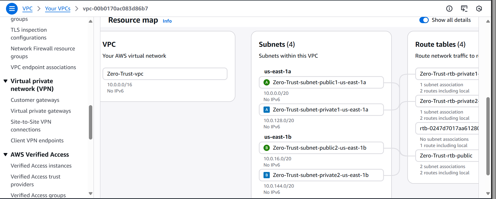

#### Subnet Strategy

**Co-locating Web Server and Wazuh Manager:**
I placed both the web server and Wazuh Manager in the same public subnet (10.0.0.0/20) with restricted security groups.

**Why public subnets for both:**
1. **Web Server** - Needs to accept HTTP/HTTPS from the internet
2. **Wazuh Manager** - Needs to be accessible by the web server agent and I need dashboard access as the administrator.

**Production vs. Demo Architecture:**

In a **Zero Trust** production environment, both should be in seperate **private subnets** with:

- **Web Server:** Behind an Application Load Balancer for inbound connections and traffic distribution, provides DDoS protection, SSL/TLS offloading and single point for    WAF integration. With no public IP, the server cannot be directly scanned or attacked from the internet. All inbound traffic must pass through ALB.
  
- **Wazuh Manager:** Behind a VPN for administrative dashboard access which will provide: Encryption (all traffic encrypted), Authentication (must connect to VPN first),    Audit trail (VPN logs who accessed and when), No internet exposure (dashboard cannot be discovered from internet)
  
- **Outbound traffic:** Through NAT Gateway with egress logging for monitoring

- **AWS service access:** Through PrivateLink endpoints. This enables data stays internal and restrictive security groups.

**The trade-offs acknowledged:**

**Network isolation:**
- Same subnet = no subnet-level isolation
- Security groups however, **limit** lateral movement by allowing only specific ports to internal services:
  - Ports 1514, 1515, 55000 to sg-wazuh (Wazuh agent communication)
  - Port 3306 to sg-database (database queries)
- If these services have vulnerabilities, an attacker can still exploit them through the allowed ports.

**Exfiltration risk:**
- Web server has outbound access to 0.0.0.0/0 on ports 80/443 (for package updates)
- Security groups cannot distinguish legitimate traffic from malicious exfiltration
- An attacker could initiate outbound connections to external IPs on these ports and exfiltrate data
- Current mitigation: SIEM monitoring (Phase 2) can detect abnormal outbound traffic patterns.

**Dashboard access:**
Wazuh dashboard is internet-accessible on port 443. Without controls, anyone knowing the IP could attempt to access it. The security control in place: **IP whitelist**; only my authorized IP address can reach the port, this prevents unauthorized access attempts from anywhere else on the internet. Even if an attacker compromises the web server on the same subnet, they cannot reach the dashboard because the security group only allows inbound on port 443 from my IP.

For this demonstration, I placed them in public subnets with strict security groups to avoid NAT Gateway and ALB costs while still maintaining security. These trade-offs are acceptable for a demonstration environment. The security controls (security groups, IP whitelist, SIEM monitoring) reduce risk without adding significant costs.

**Multi-AZ Architecture:**
I deployed across two availability zones (us-east-1a and us-east-1b) to demonstrate high availability concepts, even though I'm only running single instances in this demo.

**Why two AZs:**
- **Database failover capability** - RDS can automatically fail over to the standby subnet if us-east-1a fails
- **Future scaling** - If I wanted to add a second web server for load balancing, I'd put it in the 1b public subnet
- **Best practice demonstration** - Shows I understand production architecture.

**Private Subnets (Database Tier):**
The database lives in the private subnets with no direct internet access:
- Primary instance in 10.0.128.0/20 (us-east-1a)
- Standby/read replica capability in 10.0.144.0/20 (us-east-1b)
- In production environment, both subnets route through NAT Gateway or VPC Endpoint for outbound connections (package updates, OS patches)
- Zero inbound routes from Internet Gateway.

**Security benefit:**
The database is network-isolated from the internet. Even if someone compromised both the web server and Wazuh Manager, they'd still need to:
1. Bypass the security group rules (only port 3306 from sg-web allowed)
2. Authenticate to the database itself
3. Navigate the fact that there's no route from the database back to the internet for data exfiltration (would need to proxy through the web server).

This is **defense in depth** - multiple layers have to fail before data is compromised.

### 1.2 Security Group Configuration

Security groups act as stateful firewalls controlling traffic at the instance level. I configured three security groups with very specific rules following the principle of least privilege.

#### Web Server Security Group
**Inbound Rules:**

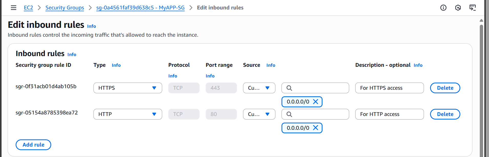

| Type | Protocol | Port | Source | Justification |
|------|----------|------|--------|---------------|
| HTTP | TCP | 80 | 0.0.0.0/0 | Public website access |
| HTTPS | TCP | 443 | 0.0.0.0/0 | Secure public website access |

**Outbound Rules:**
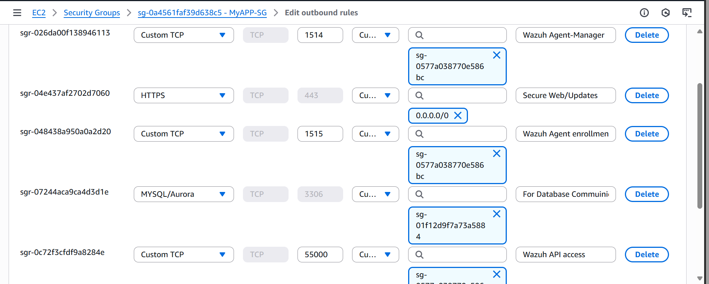

| Type | Protocol | Port | Destination | Justification |
|------|----------|------|-------------|---------------|
| HTTP | TCP | 80 | 0.0.0.0/0 | Package repositories |
| HTTPS | TCP | 443 | 0.0.0.0/0 | Package updates, HTTPS traffic |
| Custom TCP | TCP | 1514 | sg-wazuh | Wazuh agent event forwarding |
| Custom TCP | TCP | 1515 | sg-wazuh | Wazuh agent enrollment |
| Custom TCP | TCP | 55000 | sg-wazuh | Wazuh API communication |
| MySQL | TCP | 3306 | sg-database | Database queries |

**Key Design Decisions:**

**Inbound Rules: HTTP/HTTPS from 0.0.0.0/0**
The web server accepts HTTP/HTTPS from any internet source. This is intentional because:
- **Public application**: The web server's primary function is serving application traffic to anyone on the internet; restricting by source IP would prevent legitimate users from accessing it
- **Minimizes attack surface**: All other ports are blocked by default, so potential attackers can only interact with HTTP/HTTPS protocols
- **Stateful by default**: Return traffic automatically flows without needing explicit outbound rules; the firewall remembers established connections

**Outbound Rules: Security Group References for Application Traffic, Protocol Restriction for Package Management**
Outbound is split into two strategies because they have different requirements:
- **Application traffic (SIEM, database)**: I restricted traffic on these ports to specific security groups, so if the Wazuh Manager or database IP changes, the rules still work. This also prevents exfiltration on these ports
- **Package management (80/443)**: Cannot realistically whitelist all package repository IPs which are globally distributed with dynamic IPs. Maintaining a whitelist would be impractical. Instead, I restricted by protocol; only HTTP/HTTPS allowed outbound, so an attacker can't exfiltrate via SSH, FTP, DNS, or other protocols

**Security Group References (sg-wazuh, sg-database) Instead of IP Addresses**
The outbound rules to Wazuh and the database use security group references instead of hardcoding IPs. This is important because:
- **Survives IP changes**: If instance IPs change, rules automatically work without manual updates
- **Clear intent**: web server talks to Wazuh or Database only on specific ports which is explicit and auditable
- **Reduces attack surface**: Traffic on these ports can only reach designated services, not random external IPs
- **Easier to maintain**: Changes propagate automatically to all referencing rules

**NO SSH Port**
There's no SSH (port 22) rule. Instead, I use AWS Systems Manager Session Manager (configured via IAM role) for administrative access. This ensures that:
- **SSH brute-force attack vector**: Port 22 is not exposed, removing it as a target for automated password guessing
- **SSH key management overhead**: No keys to generate, store, rotate, or accidentally expose in logs
- **Identity-based audit trail**: All sessions logged to CloudTrail with user identity, timestamp, and session activity
- **IAM-based permissions**: Fine-grained access control via roles and policies instead of OS-level SSH key permissions
- **Encrypted HTTPS channel**: Secure communication without managing SSH protocol complexity

#### Wazuh Manager Security Group
**Inbound Rules:**

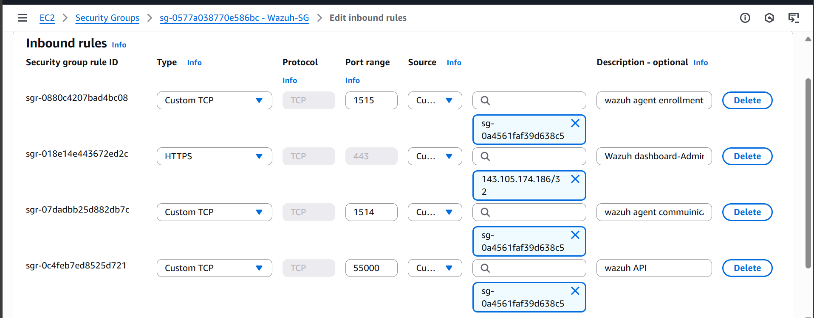

| Type | Protocol | Port | Source | Justification |
|------|----------|------|--------|---------------|
| Custom TCP | TCP | 1514 | sg-web | Agent log events |
| Custom TCP | TCP | 1515 | sg-web | Agent registration |
| Custom TCP | TCP | 55000 | sg-web | Wazuh API (agent management) |
| HTTPS | TCP | 443 | My IP | Wazuh dashboard access |

**Outbound Rules:**

| Type | Protocol | Port | Destination | Justification |
|------|----------|------|-------------|---------------|
| HTTPS | TCP | 443 | 0.0.0.0/0 | AWS API calls, package updates |
| HTTP | TCP | 80 | 0.0.0.0/0 | Domain name resolution |

**Critical security controls:**

1. **Agent ports (1514, 1515, 55000) only accept connections from sg-web**
   - Even though Wazuh Manager is in a public subnet, these ports can't be reached from the internet
   - Only the web server can connect
   - If I had multiple agents in production, I'd allow their security groups too

2. **Dashboard access (443) restricted to my IP address**
   I'm the only one who can access the Wazuh web interface, this prevents unauthorized access to the SIEM. **In production**, this would be: VPN endpoint (all admins route through VPN), AWS PrivateLink (no public access at all) Or behind a bastion host in private subnet

**Why I allowed my specific IP:**
The Wazuh dashboard contains sensitive security information: alerts, logs, configuration. Allowing access from only my IP means even if someone knew the Wazuh Manager's public IP, they couldn't reach the dashboard. This is a compromise for a demo environment; production would use VPN or PrivateLink to avoid public exposure entirely.

**No SSH here either:**
Same as the web server - using Systems Manager Session Manager via IAM role for administrative access.

#### Database Security Group

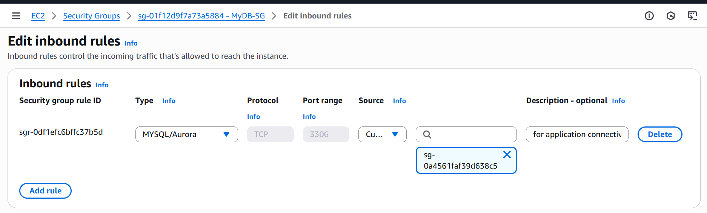

**Inbound Rules:**

| Type | Protocol | Port | Source | Justification |
|------|----------|------|--------|---------------|
| MySQL | TCP | 3306 | sg-web | Database queries from web application |


**Most restrictive security group:**
The database accepts connections ONLY from the web server security group. Nothing else can reach port 3306.

**Why the database is in private subnet:**

Even with security group protection, I demonstrated defense in depth by adding network-level isolation. The database has no public IP address and cannot be reached from the internet (no IGW route), it can only be accessed through the web server instance security group.

This creates layers of security. An attacker would need to:
1. Compromise the web server
2. Bypass security group rules
3. Then reach the database

### 1.3 Identity and Access Management (IAM)

Instead of managing SSH keys and opening port 22, I used AWS IAM roles and Systems Manager Session Manager for secure instance access.

#### Web Server IAM Role

**Attached Policies:**
- `AmazonSSMManagedInstanceCore` - Enables Session Manager access

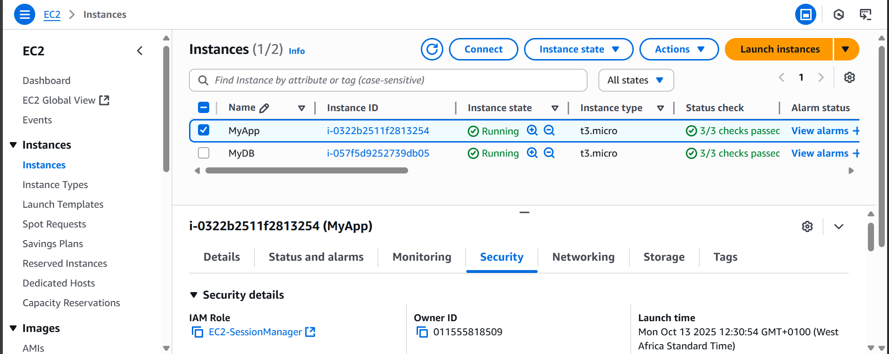

**Why this approach:**

Traditional SSH access requires **managing SSH key pairs**, opening **port 22 which is acommon attack vector** and there is **no audit trail** of what commands were run as well as the **risk of compromised or leaked keys**

Session Manager provides:
- No SSH keys to manage
- No port 22 exposure
- All sessions logged to CloudTrail
- Can restrict access through IAM policies
- Can record session commands for compliance

With session manager, every session is logged: who connected, when, and  what commands they ran.

#### Wazuh Manager IAM Role

**Attached Policies:**
1. `AmazonS3ReadOnlyAccess` - Read CloudTrail logs from S3
2. `AmazonSSMManagedInstanceCore` - Session Manager access
3. `CloudWatchLogsReadOnlyAccess` - Read CloudWatch logs

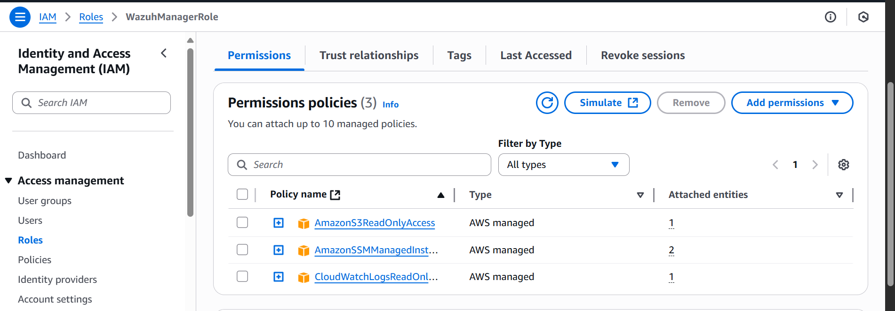

**Why these permissions:**

**1. AmazonS3ReadOnlyAccess:**

The Wazuh Manager needs to read CloudTrail logs from the S3 bucket (`zerotrust123`) to ingest AWS API activity into the SIEM. The `aws-s3` module in Wazuh polls this bucket every 10 minutes for new logs.

Read-only is sufficient; Wazuh only needs to `GetObject` and `ListBucket`, not write or delete.

**2. CloudWatchLogsReadOnlyAccess:**

Wazuh Manager also needs to ingest  VPC Flow Logs from CloudWatch Logs which provides network-level visibility, showing what IPs connected to what, which ports were used, 
and whether traffic was accepted or rejected. This complements CloudTrail's API-level visibility, enabling detection of lateral movement, port scanning, and data exfiltration attempts that API logs alone wouldn't catch.

**3. AmazonSSMManagedInstanceCore:**

Session Manager access for secure administrative tasks (checking logs, restarting services, troubleshooting). This eliminates the risk of open SSH port or SSH key management. All connections use IAM authentication over encrypted HTTPS channel, with all session initiation logged to CloudTrail (identity-based audit trail showing who accessed what and when).

**Least privilege consideration:**

In production, I'd use a custom IAM policy instead of AWS managed policy for S3Bucket Read Access:
```json
{
  "Version": "2012-10-17",
  "Statement": [
    {
      "Effect": "Allow",
      "Action": [
        "s3:GetObject",
        "s3:ListBucket"
      ],
      "Resource": [
        "arn:aws:s3:::zerotrust123",
        "arn:aws:s3:::zerotrust123/*"
      ]
    }
  ]
}
```
This is more restrictive than `AmazonS3ReadOnlyAccess` which allows reading from ALL S3 buckets in the account. For a demo, the managed policy is fine, but production should be scoped to specific resources.

---

### 1.4 CloudTrail Audit Logging

#### Why CloudTrail

AWS doesn't log API activity by default. Without CloudTrail, if someone modified a security group, created an EC2 instance, changed an IAM policy or accessed an S3 bucket, there would be no record of it. CloudTrail provides an audit trail of every API call made in the AWS account and it's immutable.

CloudTrail captures for every API call:

- **Who** - IAM user or role that made the call
- **What** - The specific action (RunInstances, DeleteBucket, etc.)
- **When** - Timestamp
- **Where** - Source IP address and AWS region
- **How** - Whether it succeeded or failed
- **Why** - Request parameters (what was changed)

#### Configuration

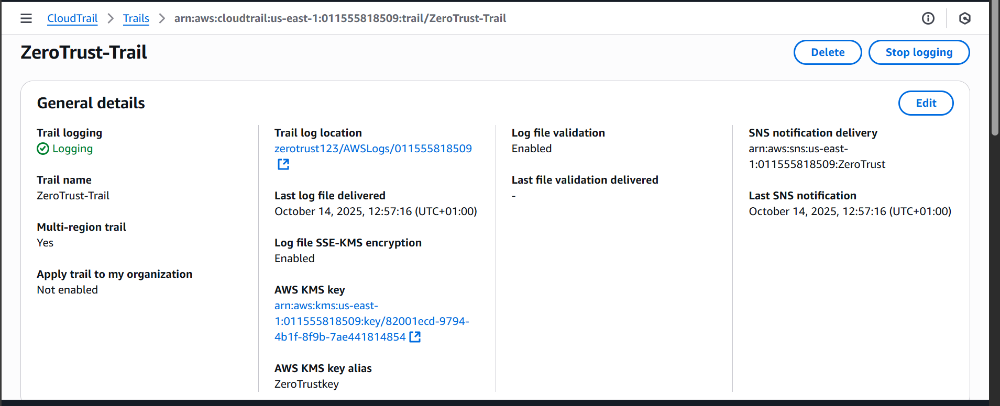

CloudTrail writes logs to S3 bucket `zerotrust123` which provides centralized log storage. I configured the bucket with:

- **SSE-KMS encryption**: Provides encryption control and audit capabilities
- **Log file validation**: Enabled; CloudTrail cryptographically signs logs, which will detect when logs are tampered.
- **Versioning**: Enabled; logs cannot be overwritten.
- **Block public access**: All four settings enabled; logs remain private
- **SNS notifications**: Configured to alert when logs are delivered to S3
- **Multi-region trail**: Enabled; captures API activity across all AWS regions

**Bucket Policy - Least Privilege:**

Only the CloudTrail service can write to this bucket. 
See [`config/phase1/s3-bucket-policy-cloudtrail.json`](config/phase1/s3-bucket-policy-cloudtrail.json) 

The policy includes:

1. **GetBucketAcl**: Allows CloudTrail to check bucket ACL before writing
2. **PutObject**: Allows CloudTrail to write logs only to the `AWSLogs/{AccountID}/*` path

Both policies are scoped to the specific trail ARN (`ZeroTrust-Trail`), preventing other trails or accounts from writing to this bucket. Even if an attacker gains a user's AWS credentials, they cannot alter the audit trail because the policy only allows this particular CloudTrail service to write, not users or other services.

**For production**, I can implement S3 Object Lock (Compliance Mode) to make logs immutable for a set period that even root cannot delete them. I can enforce MFA Delete to require MFA for deleting  or changing bucket polcies. I can also implement strict IAM policies with least privilege to control who can delete or modify bucket settings. 

This multi-layer approach ensures that if credentials are compromised, attackers still cannot erase the audit trail, meeting PCI DSS and HIPAA requirements for immutable logging.

#### Integration with Wazuh

- **Alerts on suspicious API activity**: Privilege escalation attempts, unauthorized security group changes, IAM policy modifications, root account usage
- **Correlation with host-based events**: Connect API-level changes (someone modified a security group) with network-level activity (unexpected connection attempts) and      host logs (failed login attempts)
- **Incident investigation**: Complete audit trail showing who did what, when, from where, and with what result
- **Compliance reporting**: Demonstrates continuous monitoring and evidence of security controls for PCI DSS audit logging requirements

CloudTrail logs reach Wazuh with 15-30 minute latency (S3 delivery + polling), suitable for investigation and compliance but not for immediate threat response. Real-time detection comes from host-based logs.

---

### 1.5 VPC Flow Logs

#### Purpose

VPC Flow Logs capture metadata about network traffic, not the packet contents but information about connections:
- Which IPs are talking to each other
- What ports they're using
- Whether the connection was allowed or denied
- How much data was transferred

This is useful for detecting port scanning, identifying data exfiltration, troubleshooting connectivity issues and network forensics during incidents

#### Configuration

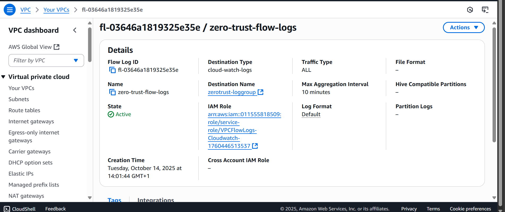

| Setting | Value | Why |
|---------|-------|-----|
| **Filter** | All (Accept + Reject) | See both allowed and blocked traffic |
| **Destination** | Cloudwatch Log | Faster threat detection to S3 |

**Architectural Decision: CloudWatch Logs vs. S3**

I configured VPC Flow Logs to write to CloudWatch Logs instead of S3 to prioritize **detection speed** for this demonstration and to show understading of both S3 (CloudTrail) and CloudWatch (Flow Logs) integration methods

VPC Flow Logs provide near real-time network visibility with ~10-15 minute latency (logs are aggregated every ~10 minutes before being written to CloudWatch). This is slower than host-based logs (~30 seconds) but faster than CloudTrail (~15-30 minutes), making VPC Flow Logs suitable for detecting lateral movement and data exfiltration patterns. 

Together, they provide layered visibility:
- Host logs: Immediate detection (seconds)
- VPC Flow Logs: Network detection (10-15 min)
- CloudTrail: API audit trail (15-30 min)

**Production Considerations:**

For high-traffic volumes (>100GB/day), VPC Flow Logs integration strategy would depend on my priorities:

- Use CloudWatch Logs for security-critical detection (real-time threat hunting)
- Archive to S3 after 30 days for compliance and cost (via lifecycle policies)
- This hybrid approach balances detection speed and cost

**IAM Role for VPC Flow Logs:**

**Automatic Role Creation:**

When creating VPC Flow Logs with CloudWatch Logs as the destination, AWS automatically creates an IAM role with the trust policy and permissions needed.

**Least Privilege Principle:**

- **Service-specific - Only VPC Flow Logs service can assume this role**: This ensures that log entries originate from the VPC Flow Logs service only, not manual user entries or other services, this maintains log intergrity and purity for compliance audits.

- **Resource restriction - Specific VPC Flow Logs log group only**: Prevents contamination when you have multiple VPC Flow Logs (public/private subnets) or other CloudWatch Logs (application, Lambda, RDS). Each log source stays isolated and trustworthy.

- **Limited scope - CloudWatch Logs actions only**: Role only has permissions for CloudWatch Logs actions
  
- **No cross-account access - Restricted to this AWS account only**: This isolates the role to a single account in multi-account environments, preventing cross-account log contamination.
  

#### Security Posture Achieved

**What this architecture accomplished:**
- Separates public-facing and sensitive infrastructure
- Reduces attack surface through security group least privilege
- Eliminates SSH key management risks
- Provides foundation for SIEM monitoring (Phase 2)
- Creates audit trail for compliance and incident response

**Where it falls short of enterprise production:**
- Wazuh Manager should be in private subnet and behind VPN
- Web Server should be in private subnet behind a load balancer
- Should use AWS PrivateLink to eliminate public internet traffic for AWS API calls and NAT Gateways for updates
- IAM policies could be more granular
- Missing DDoS protection
  
These trade-offs are appropriate for a demonstration environment. I demonstrated a good understanding of the principles required in production.

---

## Phase 2: Centralized SIEM Monitoring

I deployed Wazuh as a centralized Security Information and Event Management (SIEM) platform to aggregate, correlate, and analyze security events from multiple sources: host-based monitoring (file integrity, authentication logs) and cloud-based monitoring (AWS CloudTrail API activity and VPC Flow Logs).

The goal was to create a single pane of glass for security visibility across the infrastructures and cloud layers.


### 2.1 Why Wazuh

**Choosing a SIEM:**

I needed a SIEM that could:
- Monitor Linux hosts (file changes, login attempts, system events)
- Ingest AWS CloudTrail logs from S3 and VPC Flow logs from CloudWatch logs
- Run custom detection rules
- Provide a web dashboard for visualization
- Be free/open-source (budget constraint for demo)

**Options I considered:**
- **Splunk** - Industry standard SIEM but not cost effective for demo projects.
- **Wazuh** - Open-source, built-in AWS integration, agent-based real-time monitoring


Wazuh uses OpenSearch (Elasticsearch) as its backend but adds security focused layers: pre-built agents for endpoint monitoring, decoders for log parsing, threat detection rules, and out-of-the-box AWS integration (no custom parsing needed for CloudTrail). Its agent-based architecture provides real-time event collection from monitored hosts (web server) and centralized correlation at the manager which is faster than polling log files.

**All-in-One Installation - Demo Trade-off:**

Wazuh's all-in-one installation puts Manager, Indexer, and Dashboard on one instance. It is **not recommended for production** because it creates a **single point of failure and limits scalability**. Separate instances allow independent scaling of components (Manager processes events, Indexer stores logs, Dashboard serves queries).

For this demo monitoring one web server, it is an acceptable trade-off

### 2.2 Wazuh Manager Deployment

I deployed Wazuh Manager on t3.large EC2 instance (10.0.8.30/20), installed Wazuh agent on web server and accessed the dashboard which has a security group restriction to allow access only from authorized IP(my ip). It showed agent connected, active and receiving real-time security events.


### 2.3 File Integrity Monitoring (FIM)

File Integrity Monitoring tracks changes to files and directories. If someone modifies critical system files or web content, FIM will detect it and generate an alert.

**Why it matters:**

Common attack: Attacker compromises web server → modifies `/var/www/html/index.html` to serve malware → visitors download malicious content. Or escalates privileges → modifies `/etc/passwd` to create persistent backdoor account. FIM catches these changes within seconds before attackers can establish persistence.

**Configuration:**
Wazuh agent monitors file creation/deletion, content changes (checksum), permission and ownership changes. Default FIM configuration in `/var/ossec/etc/ossec.conf` monitors critical system files and web root by default.

**Testing FIM:**
I modified multiple critical files to test detection:

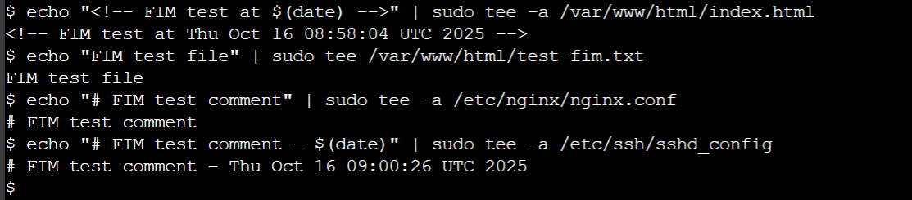


**Results:**

Wazuh detected all 4 file changes within 30-60 seconds:

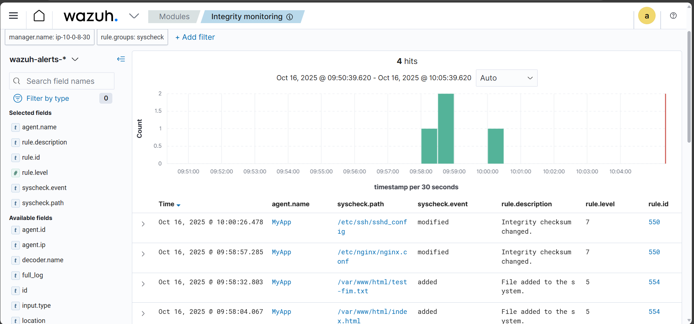

This demonstrates FIM detecting both configuration file modifications (SSH, nginx) and web content changes in real-time, catching persistence attempts before they're established.

**Note:** Terminal shows UTC time, Wazuh Dashboard displays local timezone (1-hour offset). Events occurred at the same moment; only display format differs.

**Events overview:**

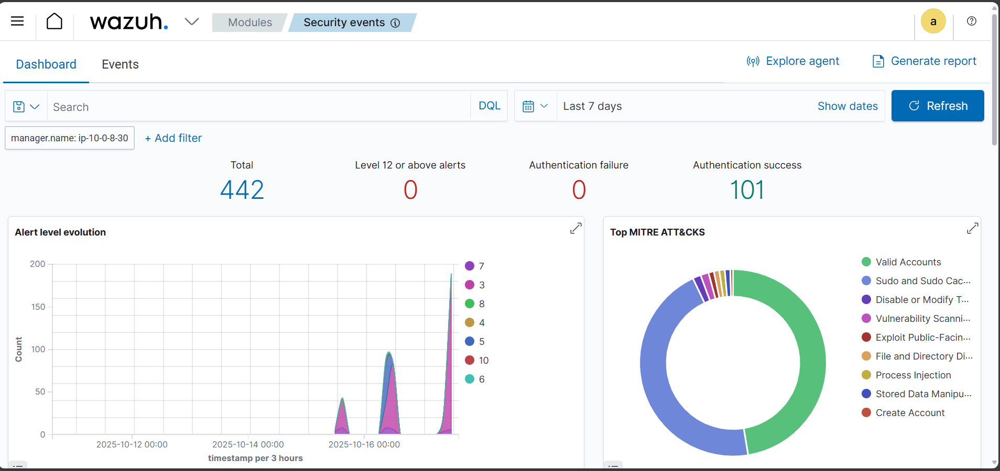

**Metrics:**
- **442 total events**
- **101 successful authentications** (SSH sessions via Session Manager)
- **0 authentication failures** (no brute-force attempts detected)
- **0 critical alerts (Level 12+)**

**Host-based monitoring working:**

The 442 events breakdown prove the agent is successfully forwarding logs from the web server to the Wazuh Manager for analysis.

---

### 2.4 AWS Logs Integration (CloudTrail + VPC Flow Logs)

I implemented ingestion of AWS security logs into Wazuh for comprehensive visibility on cloud activities; both API-level actions (CloudTrail) and network-level traffic (VPC Flow Logs).


**Wazuh Integration Configuration**

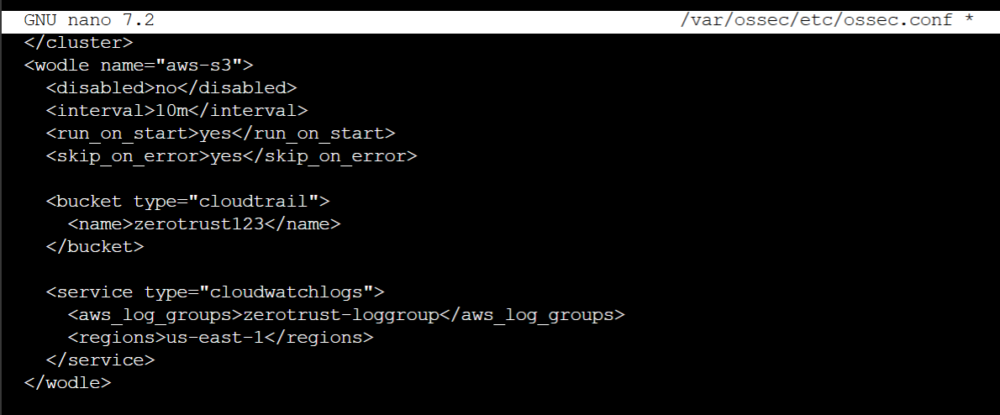

**Single configuration for both sources in `/var/ossec/etc/ossec.conf`:**
```xml
<wodle name="aws-s3">
    <disabled>no</disabled>
    <interval>10m</interval>
    <run_on_start>yes</run_on_start>
    <skip_on_error>yes</skip_on_error>

    <bucket type="cloudtrail">
        <name>zerotrust123</name>
    </bucket>

    <service type="cloudwatchlogs">
        <aws_log_groups>zerotrust-loggroup</aws_log_groups>
        <regions>us-east-1</regions>
    </service>
</wodle>
```

**IAM permissions required:**

Remember from Phase 1, the Wazuh Manager IAM role has:
- `AmazonS3ReadOnlyAccess` - For CloudTrail bucket access
- `CloudWatchLogsReadOnlyAccess` - For VPC Flow Logs access

The IAM role provides credentials automatically (no access keys needed).

**Results:**

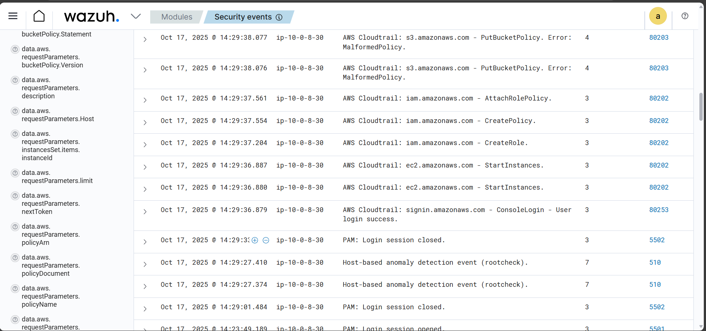

✅ **CloudTrail (S3) - Working**
- Wazuh polls S3 every 10 minutes
- AWS API events visible: IAM policy creation, role creation, instance management, console logins
- Complete audit trail of administrative actions

**Clicking on a CloudTrail event shows full JSON:** Neccessary for **Incident investigation:** Who made the change and why, **Compliance auditing:** Proof of who accessed what, **Threat hunting:** Correlation with other suspicious activity, **Forensics:** Complete reconstruction of events.

❌ **VPC Flow Logs (CloudWatch) - Configured but Not Ingesting**
- Log group name is correct (`zerotrust-loggroup`)
- IAM permissions was attached (`CloudWatchLogsReadOnlyAccess`)
- Configuration in place, but logs not appearing in Wazuh
- This requires further troubleshooting

---

### 2.5 Custom Detection Rules

**Now that AWS logs are flowing into Wazuh, I created custom rules to detect cloud-specific threats.**

Wazuh's built-in rules detect generic threats (failed logins, file changes). Cloud-specific threats require custom detection logic: security group modifications, root account usage, brute force attempts, S3 bucket exposure. 

I created 5 custom rules mapped to MITRE ATT&CK framework to detect these threats.

**Understanding Wazuh Rules:**

Each rule has key components:

- **if_sid**: References a parent rule. Most custom rules depend on if_sid="80202" (Wazuh's built-in generic CloudTrail rule). My custom rule would only trigger if the generic CloudTrail rule matched first, this ensures it's alerting on actual AWS events not random log data.

- **if_matched_sid**: References a PREVIOUS CUSTOM RULE I have  created, not a wazuh generic rule. This creates correlation-detecting patterns 
  across multiple events. Brute force detection requires this (not just one failed login, but multiple failures = attack pattern).

- **field name**: Specifies which CloudTrail field to match (e.g., aws.eventName, aws.userIdentity.type). Field matching extracts specific data from AWS JSON logs.

- **overwrite="yes"**: REPLACES Wazuh's generic rule with my custom rule. Without it, the generic Wazuh rule matches first and fires; my custom rule never triggers. By adding overwrite="yes", my custom rule OVERWRITES the generic rule, ensuring my custom description, MITRE mapping, and severity level are used instead.

- **level**: Determines alert severity and filtering (1-15 scale). Level 1-3: informational (debug, not actionable). Level 4-7: low/medium (worth investigating). Level 8-11: high (immediate attention). Level 12-15: critical (incident response required). Severity determines: which alerts are displayed in dashboards, which trigger notifications/paging, which bypass filters. Higher levels ensure critical threats don't get lost in noise.

- **frequency & timeframe**: Used for correlation. Rule 100013 triggers when Rule 100012 matches 3 times within 300 seconds which detects brute force patterns, not single events.

**Why MITRE ATT&CK Mapping Matters:**

Mapping rules to MITRE techniques provides:
- **Common language**: Security teams understand "T1562.007" (Disable Cloud Firewall) immediately
  
- **Threat intelligence correlation**: Connect detected events to known attacker TTPs 

- **Incident response playbooks**: Each MITRE technique has documented response procedures
  
- **Coverage assessment**: Track which attack lifecycle stages I detect (Initial Access, Persistence, Defense Evasion, etc.)

#### Rule Creation Process

```bash
sudo nano  /var/ossec/etc/rules/local_rules.xml
```

**Wazuh Custom Rules:** [`config/phase2/wazuh-custom-rules.xml`](config/phase2/wazuh-custom-rules.xml)

```xml
<group name="aws,">
  <!-- Rule 100010: Detect Security Group Modifications -->
  <rule id="100010" level="10" overwrite="yes">
    <if_sid>80202</if_sid>
    <field name="aws.eventName">AuthorizeSecurityGroupIngress|AuthorizeSecurityGroupEgress|RevokeSecurityGroupIngress|RevokeSecurityGroupEgress<>
    <description>AWS Security Group was modified</description>
    <mitre>
      <id>T1562.007</id>
    </mitre>
  </rule>

  <!-- Rule 100012: Failed AWS Console Login -->
  <rule id="100012" level="8" overwrite="yes">
    <if_sid>80202</if_sid>
    <field name="aws.eventName">^ConsoleLogin$</field>
    <field name="aws.responseElements.ConsoleLogin">^Failure$</field>
    <description>AWS Console login failed</description>
    <mitre>
      <id>T1078</id>
    </mitre>
  </rule>
  <!-- Rule 100013: Multiple Failed Logins -->
  <rule id="100013" level="10" frequency="3" timeframe="300">
    <if_matched_sid>100012</if_matched_sid>
    <description>Multiple AWS Console login failures detected (Possible brute force)</description>
    <mitre>
      <id>T1110</id>
    </mitre>
  </rule>

  <!-- Rule 100014: Root Account Usage -->
  <rule id="100014" level="12">
    <if_sid>80202</if_sid>
    <field name="aws.userIdentity.type">^Root$</field>
    <description>AWS Root account was used</description>
    <mitre>
      <id>T1078.004</id>
    </mitre>
  </rule>
   <!-- Rule 100015: S3 Bucket Made Public -->
  <rule id="100015" level="12" overwrite="yes">
    <if_sid>80202</if_sid>
    <field name="aws.eventName">PutBucketAcl|PutBucketPolicy</field>
    <match>AllUsers|AuthenticatedUsers</match>
    <description>S3 Bucket permissions changed to public</description>
    <mitre>
      <id>T1530</id>
    </mitre>
  </rule>
</group>
```

#### Rule Breakdown and Testing

**1. Rule 100010 - Security Group Modifications:**

**Triggers when:** Someone adds/removes security group rules

**Why critical:** Security groups are cloud firewalls. Unauthorized changes could: 
- Expose infrastructure (0.0.0.0/0 on SSH)
- Block legitimate traffic (remove required rules)
- Create backdoors

**MITRE ATT&CK:** T1562.007 - Disable or Modify Cloud Firewall  
**Severity:** Level 10 (High)

**In production:** This alert would trigger immediate investigation to  verify if it is an authorized change, Who approved it, does it violate policy and should it be reverted?


**2. Rule 100012 - Failed AWS Console Login**

**Triggers when:** ConsoleLogin event with Failure response
**Why critical:** Individual failed login. Parent rule for brute force detection.
**MITRE ATT&CK:** T1078 - Valid Accounts 
**Severity:** 8 (Medium)


**3. Rule 100013 - Brute Force Detection:**

**Triggers when:** 3+ failed console logins from same account within 5 minutes
**Why it matters:** It is a signature of password guessing attack
**MITRE ATT&CK:** T1110 - Brute Force  
**Severity:** Level 10 (High)
**Rule chaining:**
1. Rule 100012 detects EACH failed login (Level 8)
2. Rule 100013 correlates multiple failures (Level 10)
**This demonstrates Wazuh's correlation engine** - connecting events over time.


**4. Rule 100014 - Root Account Usage:**

**Triggers when:** AWS root account is used
**Why critical:** AWS best practice is to NEVER use root for daily operations. Root has: Unlimited permissions (can't be restricted), Can close account, Can change billing, Can modify organization settings. Usage indicates policy violation, compromised credentials or unauthorized access.
**MITRE ATT&CK:** T1078.004 - Cloud Accounts  
**Severity:** Level 12 (Critical)
**This would be a critical incident in production:** that may require paging on-call engineer immediately, Investigating  Who or Why it was authorized, reviewing all actions taken with root, consider rotating root credentials or documenting justification if it was legitimate.


**Results:**

This shows Wazuh dashboard detecting the custom rules triggering.

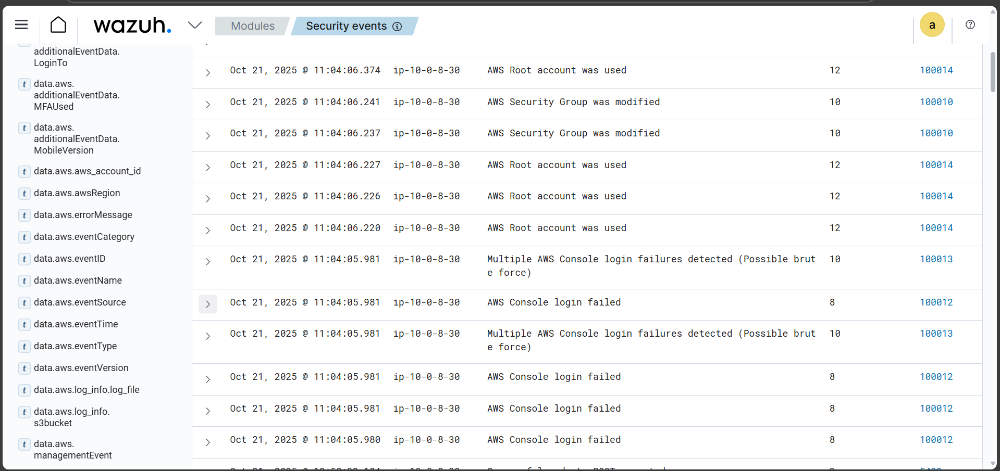

### 2.6 Operational Security: Disk Space & Log Integrity

**Challenge Encountered:**
During SIEM implementation, Wazuh indexer (OpenSearch) encountered disk saturation at 95% capacity, causing the dashboard to become inaccessible with API errors.

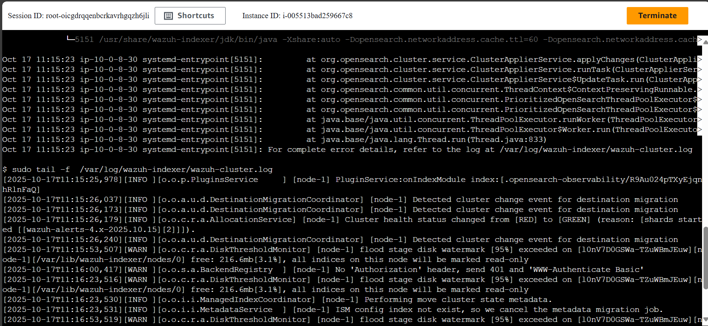

**Root Cause - Demo Architecture Limitation:**

The all-in-one Wazuh installation on a single t3.large instance with limited disk space meant all three components competed for storage. OpenSearch indices accumulated rapidly without lifecycle management.

**Why This Matters for Security:**
1. **Loss of Visibility:** Full disk stops log ingestion. The SIEM becomes blind to attacks despite detection rules being in place.

2. **Service Disruption:** Disk saturation caused OpenSearch to crash, blocking dashboard access and losing in-flight alerts preventing incidents investigation.

This is a **self-inflicted denial of service** that creates undetected dwell time during attacks.

**Resolution (Demo):**

I extended the root filesystem to restore dashboard access and resolve immediate outage.

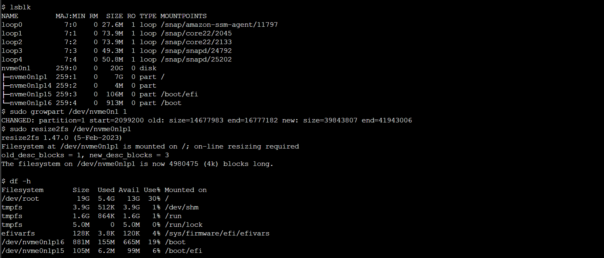

**Production Improvements:**

This incident highlights why production deployments require:

- **Separate instances:** Manager, Indexer, and Dashboard on different servers allow independent scaling. If one component grows, it doesn't starve others.

- **Larger storage:** t3.large with 100GB+ root volume prevents saturation from normal operations.

- **Index lifecycle policies:** Automatically delete indices older than 30 days, archive to S3 for compliance (PCI DSS requires 90-365 day retention on cheaper storage).

In a production environment, this incident should have been caught by monitoring disk usage and setting alerts at 80% capacity. For this demo, it demonstrates why infrastructure health is a security control; detection rules are only as good as logging infrastructure can support.

### 2.7 Detection Timelines

**CloudTrail Detection Latency:**

CloudTrail logs reach Wazuh with 15-30 minute latency due to S3 buffering and polling. This is acceptable for investigating API-level changes (who modified security groups, when, from where) and satisfies PCI DSS audit logging requirements. However, it's too slow for immediate threat containment.

**Host-Based Detection (Comparison):**

Wazuh agent logs from the web server are processed in real-time (30 seconds). This enables immediate detection of file changes, authentication failures, and system events.

**Automated Response (Phase 3):**

To bridge the gap, in Phase 3, I demonstrated automated response with with wazuh active response and EventBridge + AWS Config for real-time response to critical infrastructure changes in seconds, dramatically reducing MTTR.


#### Security Capabilities Achieved

- Host-based threats; Detected in 30 seconds (real-time)
- Detect unauthorized infrastructure changes (security groups)  
- Identify root account misuse  
- Detect brute force attacks through event correlation  
- Audit trail for investigation and compliance  
- Multi-layer visibility (API + host events)
- Pattern-based attacks: Detected through rule correlation 
  

**Phase 2 detects threats. Phase 3 stops them.** 

### Production Recommendations

**1. Implement log filtering**
- CloudTrail: Focus on write events initially (read events create alert noise)
- Gradually add read event monitoring as team matures
- Filter out routine operations (describe, list, get) to reduce false positives

**2. Set up lifecycle policies**
Data lifecycle management separates hot, warm, and cold storage; recent logs in SIEM for fast queries, older logs in Glacier for compliance retention. This balances cost and investigation speed.

**3. Monitor integration health**
- Alert if no CloudTrail events for 30 minutes (indicates logging failure)
- Implement dashboard showing "last event received" timestamps for each data source
- This prevents blind spots where attacks occur but aren't being logged

**4. Rule tuning process**
Create rules, measure false positives, add exclusions for benign activity, adjust severity to prioritize actionable alerts, Iterate until alert volume is manageable and high-fidelity. 

**5. Infrastructure as Code**
- Version control all rule configurations, IAM policies, and integrations
- Enables repeatable deployments across multiple environments
- Facilitates disaster recovery and scaling

---

## Phase 3: Automated Response & CSPM

I transitioned from **detection** to **automated response**, reducing Mean Time to Respond (MTTR) from hours/minutes to seconds. Implemented Security Orchestration, Automation and Response (SOAR) for threat containment and Cloud Security Posture Management (CSPM) for compliance enforcement.

### 3.1 SOAR: Automated Brute Force Protection

#### The Threat: SIEM Dashboard Compromise

**Why this is critical:** If an attacker compromises the Wazuh dashboard, they can disable detection rules, delete logs, view sensitive data and identify blind spots. The SIEM system is a high-value target in enterprise breaches.

#### Implementation Details

**Challenge: Getting Wazuh to Recognize Dashboard Authentication Events**

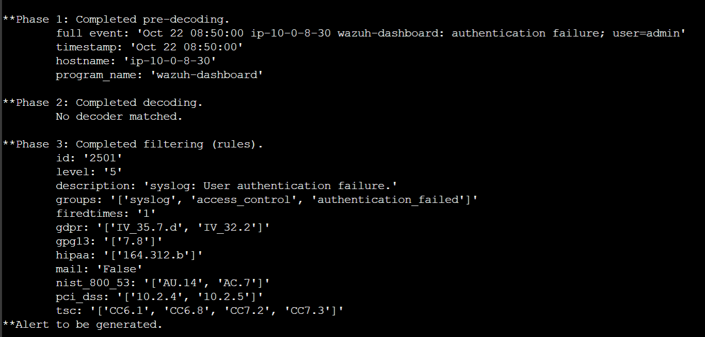

Wazuh was triggering the generic authentication rule (2501 - Level 6) for failed logins, but I needed to:
1. Specifically identify Wazuh Dashboard authentication failures
2. Count individual failures for correlation
3. Trigger custom rule with higher severity

**Solution: Custom decoder rules** in `/var/ossec/etc/decoders/local_decoder.xml`

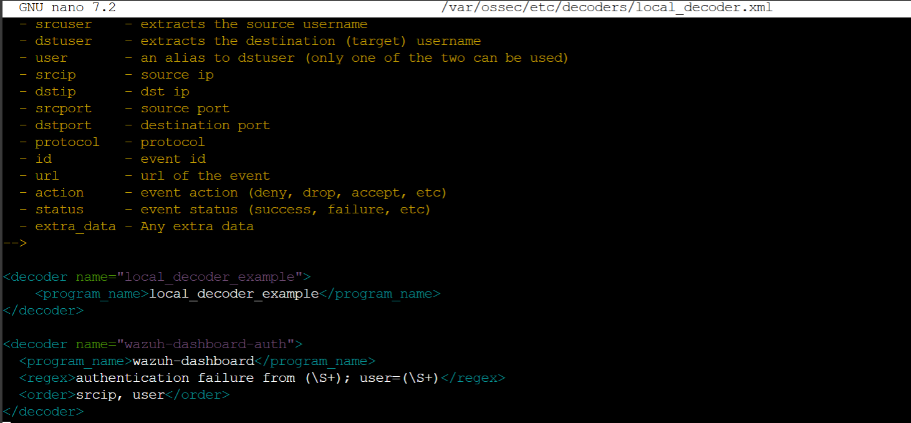

```xml
<decoder name="wazuh-dashboard-auth">
  <program_name>wazuh-dashboard</program_name>
  <regex>authentication failure from (\S+); user=(\S+)</regex>
  <order>srcip, user</order>
</decoder>
```
**What this decoder does:**

- **`<program_name>`** - Matches logs from "wazuh-dashboard" process
- **`<regex>`** - Extracts source IP and username from log message
- **`<order>`** - Maps regex capture groups to fields (srcip, user)

**Why this matters:**
Without the decoder, Wazuh sees the log but can't extract the source IP. The `<same_source_ip />` condition in Rule 100051 wouldn't work. The decoder makes the IP field available for correlation.

---

**Step 1: Created custom Detection Rules**  

**SOAR Custom Rules:** [`config/phase3/wazuh-soar-rules.xml`](config/phase3/wazuh-soar-rules.xml)

```xml
<group name="authentication,wazuh,">
  <!-- Rule 100050: Failed Wazuh Dashboard Login -->
  <rule id="100050" level="7">
    <if_sid>2501</if_sid>
    <program_name>wazuh-dashboard</program_name>
    <description>Failed authentication attempt to Wazuh Dashboard</description>
    <group>authentication_failed,pci_dss_10.2.4,pci_dss_10.2.5,</group>
  </rule>

  <!-- Rule 100051: Multiple Failed Wazuh Dashboard Logins (Brute Force) -->
  <rule id="100051" level="10" frequency="3" timeframe="120">
    <if_matched_sid>100050</if_matched_sid>
    <same_source_ip />
    <description>Multiple failed authentication attempts to Wazuh Dashboard - Possible brute force attack</description>
    <mitre>
      <id>T1110.001</id>
    </mitre>
    <group>authentication_failures,pci_dss_10.2.4,pci_dss_10.2.5,</group>
  </rule>

</group>
```

**Why depend on rule 2501?**

Rule 2501 is Wazuh's built-in generic authentication failure rule. By using `<if_sid>2501</if_sid>`, I'm saying: "If rule 2501 fires (authentication failure) AND it's from wazuh-dashboard program, then also fire rule 100050". This is **rule inheritance**; building specific detection on top of generic patterns.

- Rule 2501 (generic) = Level 6
- Rule 100050 (specific) = Level 7 (higher than parent)
- Rule 100051 (correlation) = Level 10 (high severity)

This creates a severity escalation

**MITRE ATT&CK mapping:**

- **T1110.001** - Brute Force: Password Guessing
- **Tactic:** Credential Access
- **Sub-technique:** Password guessing (vs. password spraying or credential stuffing)

**Step 2: Configured Active Response** To automatically execute the firewall-block.sh script when Rule 100051 fires.

```bash
sudo nano /var/ossec/etc/ossec.conf
```

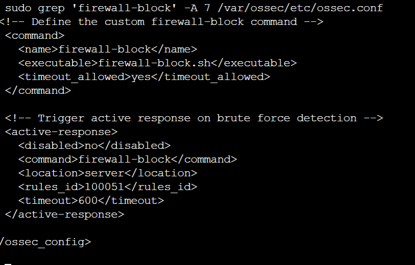

```xml
<command>
  <name>firewall-block</name>
  <executable>firewall-block.sh</executable>
  <timeout_allowed>yes</timeout_allowed>
</command>

<active-response>
  <disabled>no</disabled>
  <command>firewall-block</command>
  <location>server</location>
  <rules_id>100051</rules_id>
  <timeout>600</timeout>
</active-response>
```

**Configuration Details:**

The `<command>` section defines what to execute: firewall-block.sh from the active-response/bin/ directory. The `<active-response>` section specifies when and where to execute it:
- **rules_id="100051"**: Execute only when brute force rule (Rule 100051) fires
- **location="server"**: Execute on the Wazuh Manager itself (where the dashboard runs and the attack originates)
- **timeout="600"**: Keep the block for 600 seconds, then automatically remove it

This ensures attacking IPs are blocked at the source (the manager's iptables firewall) within seconds of the brute force correlation.

**Step 3: Created firewall-block.sh Script** 

**Firewall Blocking Script:** [`scripts/phase3/firewall-block.sh`](scripts/phase3/firewall-block.sh)

```bash
sudo nano /var/ossec/active-response/bin/firewall-block.sh
```

```bash
#!/bin/bash
# firewall-block.sh - Wazuh 4.x+ format with JSON input
# Compatible with Wazuh 4.0+

LOCAL=`dirname $0`
cd $LOCAL
cd ../
PWD=`pwd`
LOG="/var/ossec/logs/active-responses.log"

# Logging function
log() {
    echo "$(date '+%Y/%m/%d %H:%M:%S') firewall-block: $1" >> ${LOG}
}

log "=== Script started ==="

# Read JSON input from stdin
read INPUT_JSON
log "Received input: $INPUT_JSON"

# Parse JSON - try jq first, fallback to grep/sed
if command -v jq &> /dev/null; then
    ACTION=$(echo "$INPUT_JSON" | jq -r '.command' 2>/dev/null)
    SRCIP=$(echo "$INPUT_JSON" | jq -r '.parameters.alert.data.srcip' 2>/dev/null)
    
    # Fallback path structure
    if [ -z "$SRCIP" ] || [ "$SRCIP" = "null" ]; then
        SRCIP=$(echo "$INPUT_JSON" | jq -r '.alert.data.srcip' 2>/dev/null)
    fi
else
    # Manual parsing without jq
    ACTION=$(echo "$INPUT_JSON" | grep -o '"command":"[^"]*"' | cut -d'"' -f4)
    SRCIP=$(echo "$INPUT_JSON" | grep -o '"srcip":"[^"]*"' | cut -d'"' -f4)
    log "Parsing without jq: ACTION=$ACTION, SRCIP=$SRCIP"
fi
```

I created firewall-block.sh to automatically block attacking IPs via iptables. The script includes critical security features:

**1. Input validation:** - Regex validates IP format to prevent command injection attacks

**2. Idempotency (safe to run multiple times):** - Checks if IP is already blocked before adding rule 

**3. Comprehensive logging:** - Every action logged with timestamps for audit trail and debugging

**4. Error handling:** - Exits with failure code if iptables command fails (Wazuh sees the failure)

The script is executed by wazuh-execd when Rule 100051 fires, blocking the source IP for 10 minutes which is long enough to stop automated attacks and short enough to allow legitimate recovery. After timeout expires, wazuh-execd automatically removes the block.

In **Production**, it would require implementing graduated response based on offense history. First offense: 10-minute block. Second offense within 24 hours: 1-hour block. Third offense: 24-hour block. Fourth offense: permanent block with manual review required. This balances security with user experience. 


**Made script executable and installed JSON parser:**
```bash
sudo chmod 750 /var/ossec/active-response/bin/firewall-block.sh
sudo chown root:wazuh /var/ossec/active-response/bin/firewall-block.sh
sudo apt update && sudo apt install -y jq
```

**Restarted Wazuh to apply configuration**


#### Testing the SOAR Automation

**I tested the SOAR automation using two methods:** **Dashboard login attempts** (real attack simulation) and **Command-line log injection** (simulation with fake IP)

**Method 1: Dashboard Login Attempts via web browser**

**Challenge encountered:**

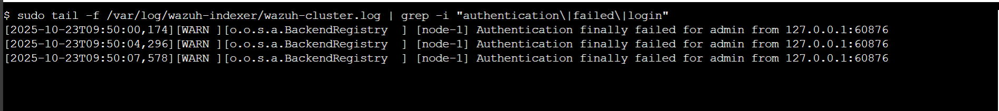

**Why this happened:**

In an all-in-one Wazuh installation, dashboard runs on the same server as the Indexer and Manager and authentication failures are logged as coming from **localhost (127.0.0.1)** **NOT** from the actual client IP making the request.

Localhost (127.0.0.1) is whitelisted by default and cannot be blocked because if it is blocked:
- Manager cannot communicate with its own Elasticsearch indexer
- Dashboard cannot query the Wazuh API
- **Entire SIEM breaks immediately** 

**Active response was not executed** because Wazuh prevents active response on whitelisted IPs.

**This is an architecture limitation, not a detection failure.**


**Method 2: Command-Line Simulation (Controlled Testing)**

**To properly test the detection and response logic, I simulated authentication failures with a fake external IP:**

**Real-Time Monitoring:**

I opened multiple terminals to watch the simulation, detection and response happen in real time.

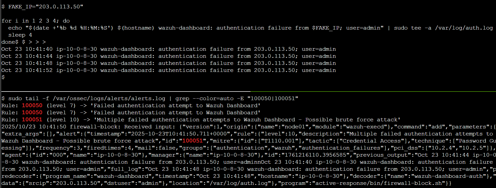

**Terminal 1 - Simulation**
```bash
FAKE_IP="203.0.113.50"

for i in 1 2 3 4; do
  echo "$(date +'%b %d %H:%M:%S') $(hostname) wazuh-dashboard: authentication failure from $FAKE_IP; user=admin" | sudo tee -a /var/log/auth.log
  sleep 4
done
```

This created authentication failure log entries using a fake external IP (203.0.113.50) to simulate a real attacker making repeated login attempts, Wazuh reads these logs and triggered the same detection rules as real attacks.


**Terminal 2 - Monitor Rule Triggers:**
```bash
sudo tail -f /var/ossec/logs/alerts/alerts.log | grep -E "100050|100051"
```

Shows Rule 100050 fire with each failed login, then Rule 100051 fire at the 3rd failure.

**Terminal 3 - Monitor Active Response Execution:**

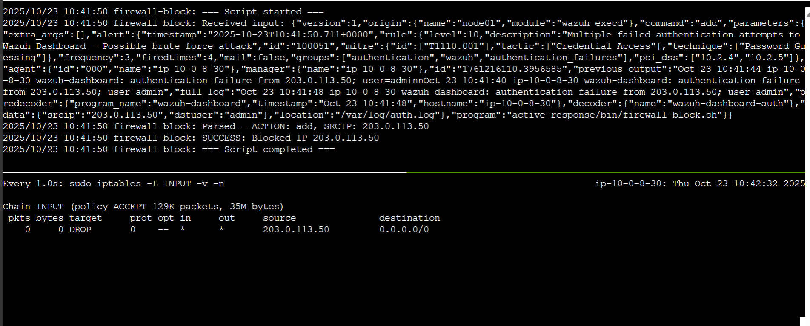

```bash
sudo tail -f /var/ossec/logs/active-responses.log
```

Shows wazuh-execd execute firewall-block.sh and confirm the IP was blocked.

**Terminal 4 - Monitor iptables Rules:**
```bash
sudo iptables -L INPUT -n
```

Shows the DROP rule appear immediately for the fake IP after Rule 100051 fired. 

**Verified IP was unblocked after 10 minutes:**
```bash
sudo iptables -L INPUT -n | grep 203.0.113.50
# No output - rule removed 
```

**Automatic timeout worked perfectly.** The IP can access the system again after 10 minutes.

**TOTAL RESPONSE TIME: 10 seconds from first failure to IP blocked**
```
10:41:40 - First authentication failure
10:41:44 - Second failure (Rule 100050 fires)
10:41:48 - Third failure (Rule 100051 correlation triggers)
10:41:50 - Wazuh-execd executes firewall-block.sh
10:41:50 - iptables rule blocks 203.0.113.50
```


**Why Terminal Simulation Is a Valid Testing:**

The log entries were injected via terminal not from real network traffic but Wazuh cannot distinguish between simulated and real attacks. It only sees log file entries in `/var/log/auth.log`. The decoder extracted srcip="203.0.113.50", the rules correlated 3 failures and active response executed; exactly as it would for a real brute force attack.

This proves the entire SOAR pipeline works correctly. The dashboard alert (shown below) confirms Custom Rule 100051 fired and was mapped to MITRE T1110.001, treating the simulated attack identically to a real attack.

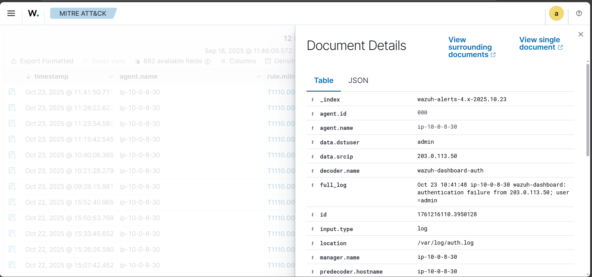

**MTTR Impact:**

This timeline demonstrates how automated detection and response dramatically reduces Mean Time To Respond. Without automation, this attack would require manual investigation and response which would take minutes or likely hours. With SOAR automation, the attack was contained within 10 seconds. 

**I Succesfully Demonstrated these:**

- Custom decoder correctly parsed authentication failures and extracted source IP  
- Rule chaining: Rule 100050 → Rule 100051 correlation worked  
- Frequency detection: 3 attempts in 120 seconds triggered correctly  
- Active response integration: wazuh-execd called script automatically  
- Script execution: Bash script parsed JSON and executed iptables  
- IP blocking: Firewall rule added successfully  
- Timeout mechanism: Automatic unblock after 10 minutes  

---


### 3.2 CSPM: Automated S3 Compliance Enforcement

**While Phase 3.1 protected the SIEM through automated response to active attacks, Phase 3.2 demonstrated Cloud Security Posture Management, protecting the cloud infrastructure and ensuring compliance to prevent potential attacks through vulnerability exploitation.**

**Scenario:**

A developer accidentally disables S3 Block Public Access while troubleshooting or worse, an attacker with compromised credentials intentionally exposes buckets to exfiltrate data. Either way, sensitive information is now accessible to anyone on the internet.


**Industry standard:** NSA/CISA guidelines recommend continuous monitoring and automated remediation for cloud security. Manual compliance processes are too slow. If a misconfiguration exists for hours before discovery, it gives attackers time to exploit it. Automated enforcement closes that window from minutes or hours to seconds.

#### My Solution: AWS Config + Lambda Automation

I demonstrated a solution  that continuously monitors S3 Block Public Access configuration. When someone disables it (accidental or malicious), AWS Config detects the change immediately and marks it NON_COMPLIANT. EventBridge immediately triggers a Lambda function that parses the event, calls the S3 API to re-enable Block Public Access and logs the action. Config re-evaluates and marks the account COMPLIANT again. Total remediation time: ~35 second

**I used Lambda instead of Config's built-in remediation** because Lambda provides flexibility for complex remediations: logging, notifications, conditional logic. This approach demonstrates serverless automation.


#### My Approach: Account-Level: `s3-account-level-public-access-blocks`

This rule checks if all 4 Block Public Access settings is enabled at the AWS account level. I enforced **account-level Block Public Access** as the baseline security control, not individual bucket-level settings.

**Bucket-level BPA:** applies only to that specific bucket and can be toggled on/off per bucket

**Account-level BPA:** applies to ALL buckets in the account, overrides bucket-level settings and provides a security backstop

When account-level Block Public Access is enabled, it overrides bucket-level settings and bucket policies. **This is intentional.** Account-level BPA is designed to be a **fail-safe** - preventing accidental or malicious public exposure across the entire account.

#### The Trade-off

For this demonstration, I used account-level Block Public Access because all buckets (CloudTrail logs, Config data) should be private. This provides defense-in-depth and aligns with CIS AWS Foundations Benchmark (S3.1) which mandates account-level BPA to enforce consistent security across all S3 resources.

**In production with different requirements:**

In organizations that need public buckets (static websites, CDN origins, public datasets), separate AWS accounts can be used; production data stays in accounts with account-level BPA enabled and public content stays in isolated accounts with different security controls. This contains blast radius and simplifies compliance.

If account separation isn't possible, bucket-level BPA with tagging allows selective public access. Lambda can check for `PublicAccess=Approved` tags before remediating, allowing legitimate public buckets while protecting everything else.

#### Continuous Compliance Automation

**Step 1:** I configured AWS Config to monitor S3 Block Public Access settings and trigger Lambda through EventBridge for automatic remediation.

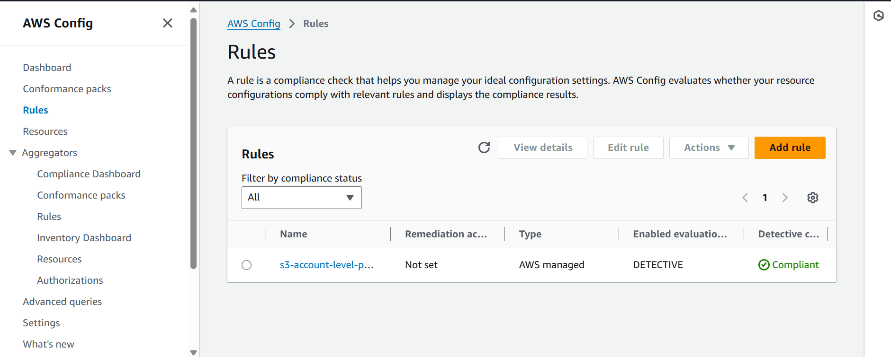


**Step 2:** I created a Lambda function that automatically re-enables Block Public Access when Config detects it's been disabled.

**Lambda Remediation Function:** [`scripts/phase3.2/lambda_function.py`](scripts/phase3.2/lambda_function.py)

```python
import json
import boto3

def lambda_handler(event, context):
    print("Event received:", json.dumps(event))
    
    # Initialize S3 control client for account-level operations
    s3control = boto3.client('s3control')
    
    # Get account ID
    sts = boto3.client('sts')
    account_id = sts.get_caller_identity()['Account']
    
    try:
        print(f"Enabling account-level Block Public Access for account: {account_id}")
        
        # Enable all 4 Block Public Access settings at account level
        response = s3control.put_public_access_block(
            AccountId=account_id,
            PublicAccessBlockConfiguration={
                'BlockPublicAcls': True,
                'IgnorePublicAcls': True,
                'BlockPublicPolicy': True,
                'RestrictPublicBuckets': True
            }
        )
        
        print(f"Successfully enabled account-level Block Public Access")
        
        return {
            'statusCode': 200,
            'body': json.dumps(f'Account-level Block Public Access enabled for account {account_id}')
        }
        
    except Exception as e:
        print(f"Error enabling Block Public Access: {str(e)}")
        raise e
```        

**Key implementation details:**
- Uses `s3control` client for account-level operations (not bucket-level `s3` client)
- Dynamically queries account ID via STS which is reusable across any AWS account.
- Enforces CIS-recommended configuration (BlockPublicAcls, BlockPublicPolicy, IgnorePublicAcls, RestrictPublicBuckets)
- Logs all actions to CloudWatch for audit trail
- Raises exceptions on failure 


**Step 3:** I Created a custom policy for the Lambda execution role and granted the minimum permissions needed.

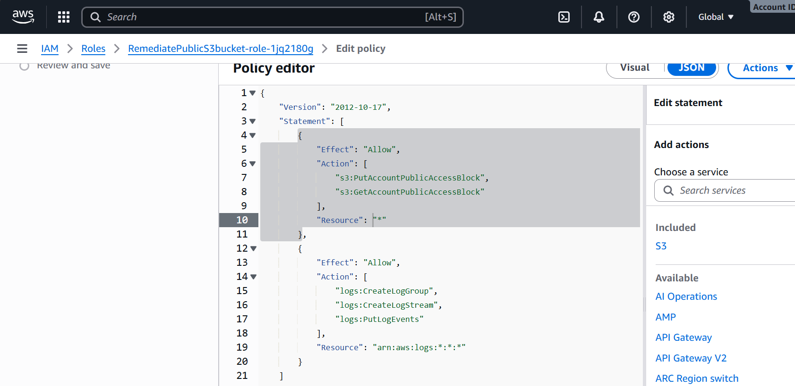

```json
{
    "Version": "2012-10-17",
    "Statement": [
        {
            "Effect": "Allow",
            "Action": [
                "s3:PutAccountPublicAccessBlock",
                "s3:GetAccountPublicAccessBlock"
            ],
            "Resource": "*"
        },
        {
            "Effect": "Allow",
            "Action": [
                "logs:CreateLogGroup",
                "logs:CreateLogStream",
                "logs:PutLogEvents"
            ],
            "Resource": "arn:aws:logs:*:*:*"
        }
    ]
}
```
**What this policy grants:**

- **s3:PutAccountPublicAccessBlock, s3:GetAccountPublicAccessBlock** Enable and verify BPA settings. Account-level operations require `"Resource": "*"` (no specific ARN)
- **logs permissions:** Write execution logs to CloudWatch for auditing and debugging

This demonstrates **least-privilege access;** Lambda can only enable BPA and log actions.


**Step 4:** I configured EventBridge that connects Config to Lambda.

When Config detects NON_COMPLIANT status, it publishes an event. EventBridge catches that event and invokes Lambda.


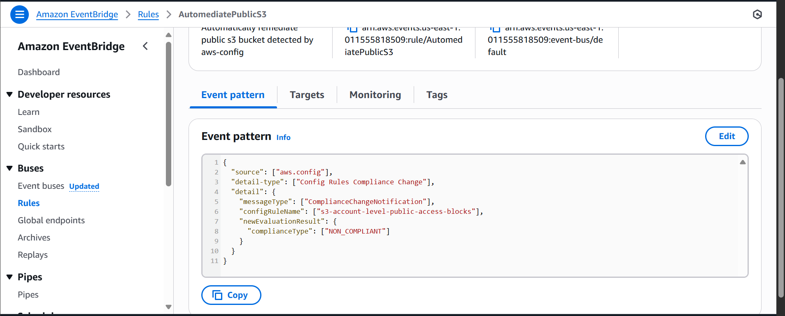

```json
Name: AutomediatePublicS3
Event pattern:
json
{
  "source": ["aws.config"],
  "detail-type": ["Config Rules Compliance Change"],
  "detail": {
    "configRuleName": ["s3-account-level-public-access-blocks"],
    "newEvaluationResult": {
      "complianceType": ["NON_COMPLIANT"]
    }
  }
}

```
**Target:** Lambda function `S3AccountPublicAccessRemediation`

**How this pattern works:**

EventBridge evaluates every event against this pattern. Only events matching ALL conditions trigger the rule. EventBridge catches it and immediately invokes Lambda to re-enable BPA.

This creates the full automation chain: **Config detects → EventBridge routes → Lambda remediates**.

#### Testing the Full Workflow

I tested the CSPM automation by disabling S3 Block Public Access and measuring detection + remediation time.

**Config immediately detected the change and marked the account NON_COMPLIANT.**

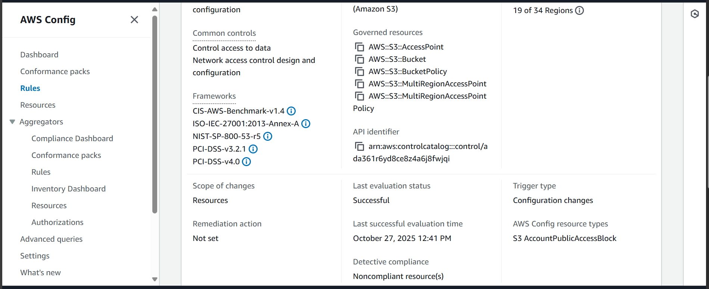

**EventBridge caught the compliance change and automatically triggered Lambda to remediate**

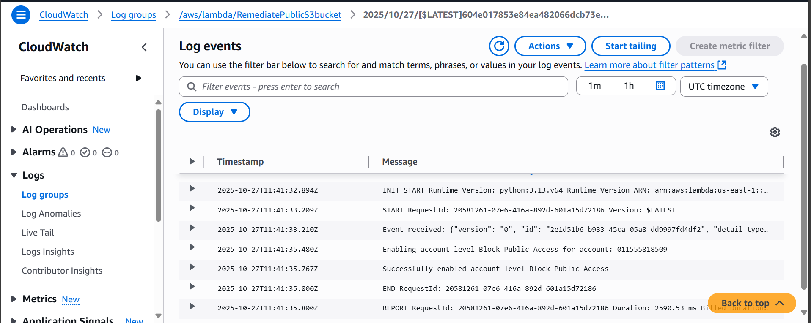

**Total response time:** ~29 seconds from misconfiguration to fix.

**I confirmed that all 4 S3 settings are back to ON**

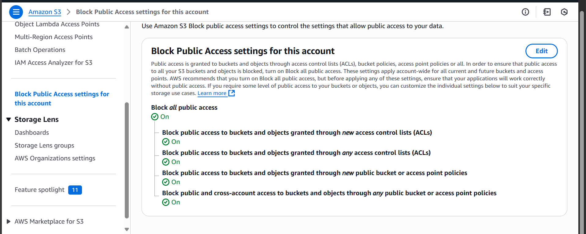

**And Config has changed to COMPLIANT**

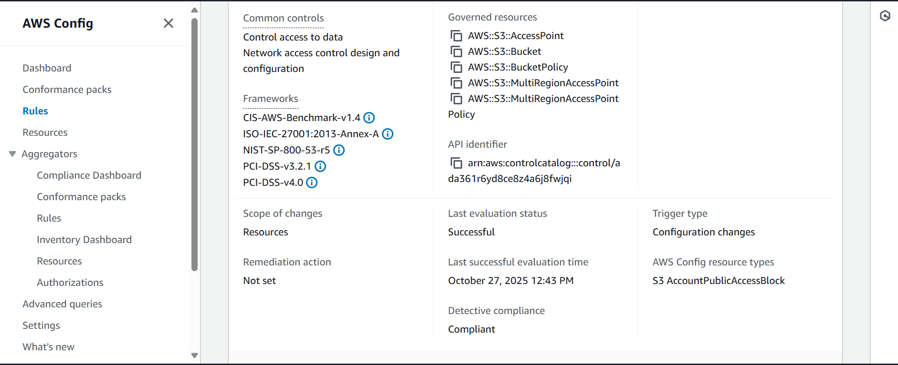

### What I Demonstrated

I built an automated compliance enforcement system for AWS S3 that demonstrates production-grade CSPM practices:

**The Pipeline:**
- **Detection:** AWS Config monitors account-level Block Public Access settings continuously
- **Alerting:** EventBridge catches compliance violations in real-time
- **Remediation:** Lambda automatically restores secure configuration
- **Verification:** Config re-evaluates and confirms compliance restored

This reduces **Mean Time To Remediate to seconds**, closing the exposure window before attackers can discover and exploit the vulnerability. This demonstrates how data breaches are prevented in modern cloud security environment. 

#### Production Enhancements

The automation I built works end-to-end, but if I deployed this to production, I would add:

**Notifications:** Configure to send SNS alerts to the security team whenever remediation occurs, capturing who disabled BPA, when, and how long it was exposed. This is critical for incident investigation and risk assessment. Right now, Lambda remediates silently with no visibility.

**Compliance Reporting:** Automated compliance reports showing remediation history, exemptions granted and current compliance status feeding directly into audit documentation.

---

### Project Conclusion

This three-phase project demonstrates a complete cloud security architecture built on defense-in-depth principles. Cloud environments present a challenge where  compromises can happen in minutes, but traditional security responses move slow (manual investigation takes hours). This project bridges that gap through architectural layers that detect and contain threats faster than attackers can exploit them. Each phase addresses a different layer of security and together they create a resilient system that detects, responds to and prevents threats.

---

### Key Insights

**1. Architecture beats policy.** 
An organization could have a written "no public S3 buckets" policy and hoped people followed it. Instead, integrating a system where the policy enforces itself takes away the dependence on human trust. Account-level Block Public Access can't be accidentally disabled, it's enforced at the infrastructure level. This is security by design, not by process.

**2. Latency is the enemy of security.**
The gap between attack and response is where breaches happen. Phase 1 reduces that gap; segmentation slows attackers down and limits what they can do. Phase 2 detects in minutes, Phase 3 detects and responds in seconds (not manually). Reducing MTTR at each layer compounds into a fundamentally more secure system.

**3. The right abstraction level matters.**
Trying to manage security at the bucket level (100+ buckets) doesn't scale. Managing at the account level does. This is why CIS Benchmark recommends account-level controls, they're easier to enforce and harder to bypass.

**4. Infrastructure health is a security control.**
When Wazuh indexer reached 97% disk capacity, the SIEM became blind to attacks despite rules being in place. Full disk stops log ingestion, creating a potential undetected dwell time; a self-inflicted denial of service. This demonstrated that continuous visibility requires not just detection rules, but infrastructure resilience. Monitoring disk usage, CPU, and memory is as important as monitoring security events. Production systems must implement index lifecycle policies and capacity planning 
to prevent logging failures during active attacks.

---


